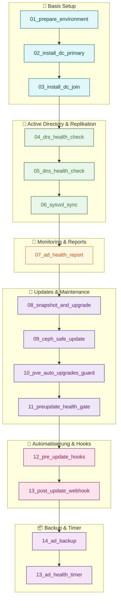

# ⚙️ Zamba / Proxmox Ansible Automation Suite

[](https://www.ansible.com/)
[](docs/CHANGELOG.md)
[](#-lizenz--nutzung)
[](https://www.proxmox.com/)

**Maintainer:** Stephan Boerner
**Stand:** November 2025
**Version:** v1.5 (latest)

---

## 🧩 Übersicht

Diese Suite automatisiert die Verwaltung einer **Zamba Active Directory Umgebung**
innerhalb eines **Proxmox-Clusters mit Ceph-Speicher**.

Ziel ist ein vollständig reproduzierbares, automatisiertes Setup mit:

* Installation & Betrieb von Samba AD Domain Controllern
* Replikation & Health Monitoring
* Ceph-sicheren Updates
* Backup- und Webhook-Automation

---

## 📁 Struktur

```bash
ansible/
 ├── ansible.cfg
 ├── group_vars/
 │   └── all.yml
 ├── playbooks/
 │   ├── 01_prepare_environment.yml
 │   ├── ...
 │   └── 14_ad_backup.yml
 └── files/
     ├── ceph-safe-update.sh
     ├── ceph-safe-update.service
     └── ceph-safe-update.timer

docs/
 ├── playbooks.md
 └── CHANGELOG.md
```

---

## 🚀 Quickstart

```bash
# Health Report erzeugen
ANSIBLE_CONFIG=ansible/ansible.cfg \
ansible-playbook ansible/playbooks/07_ad_health_report.yml

# Sicheres Cluster-Update
ANSIBLE_CONFIG=ansible/ansible.cfg \
ansible-playbook ansible/playbooks/09_ceph_safe_update.yml

# Online-Backup des AD-Controllers
ANSIBLE_CONFIG=ansible/ansible.cfg \
ansible-playbook ansible/playbooks/14_ad_backup.yml
```

---

## 🧠 Highlights

| Kategorie            | Playbook | Beschreibung                             |
| -------------------- | -------- | ---------------------------------------- |
| 🧱 Installation      | 01–03    | Aufbau & Join der DCs                    |
| 🔁 Replikation & DNS | 04–05    | DRS/DNS Health Checks                    |
| 🗝 SYSVOL Sync       | 06       | Key-Setup & Rsync zwischen DCs           |
| 🧾 Monitoring        | 07       | Markdown Health Report                   |
| 💾 Sicheres Upgrade  | 08–11    | Snapshot, Ceph-Safe Update & Health-Gate |
| 🔔 Automatisierung   | 12–13    | Hooks & Webhook-Notification             |
| 🧩 Backup            | 14       | Online-Backup mit Kerberos-Auth          |

---

## 📚 Dokumentation

📘 **Vollständige Playbook-Referenz:**
➡ [`docs/playbooks.md`](docs/playbooks.md)

🧾 **Änderungsverlauf / Versionshistorie:**
➡ [`docs/CHANGELOG.md`](docs/CHANGELOG.md)

---

## 🔄 Versionen

| Version  | Datum      | Änderungen                       |
| -------- | ---------- | -------------------------------- |
| v1.0     | 2025-10-10 | Grundstruktur, Zamba Setup       |
| v1.2     | 2025-10-20 | SYSVOL-Rsync, Health Report      |
| v1.3     | 2025-10-29 | Dokumentation & Struktur         |
| v1.4     | 2025-11-03 | Webhook, Update-Guard            |
| **v1.5** | 2025-11-04 | AD-Backup, Health-Gate, Ceph-Fix |

---

## 🧩 Lizenz & Nutzung

> © 2025 Stephan Boerner
> Nutzung ausschließlich intern für Kanzlei- und Infrastrukturzwecke
> **Keine Weitergabe oder Veröffentlichung erlaubt**

---

## 🗺️ Playbook-Flow (Übersicht)

*Visualisierte Reihenfolge aller Ansible-Playbooks (01 → 14) in logischer Ausführungsreihenfolge.*



---

🧰 *Zamba / Proxmox Automation Suite – designed for reproducible, reliable infrastructure.*
