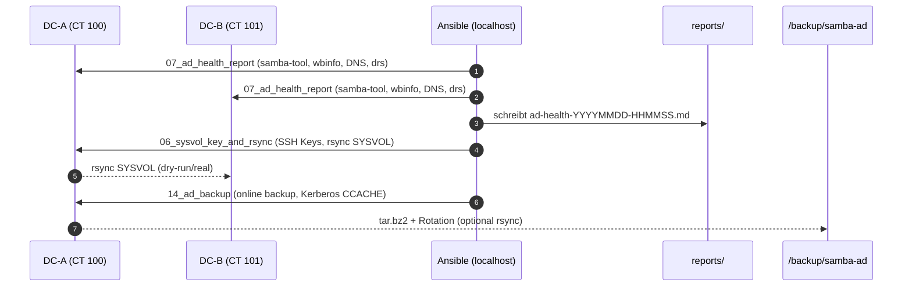

# Diagrams – Zamba / Proxmox Automation Suite

> Visuelle Übersicht der Playbooks, Abläufe und Komponenten.  
> Kompatibel mit GitHub & Obsidian (Mermaid).

---

## 1) Gesamt-Flow: AD-Setup → Health → DNS → SYSVOL → Reports

```mermaid
flowchart TD
    A01[01_prepare_environment] --> A02[02_install_dc_primary]
    A02 --> A03[03_install_dc_join]
    A03 --> A04[04_drs_health_check]
    A04 --> A05[05_cross_dns_and_sysvol (DNS/SYSVOL Fix)]
    A05 --> A06[06_sysvol_key_and_rsync]
    A06 --> A07[07_ad_health_report]
    A07 --> A08[08_snapshot_and_upgrade]
    A08 --> A11[11_preupdate_health_gate]
    A11 --> A09[09_ceph_safe_update]
    A09 --> A10[10_pve_auto_upgrades_guard]
    A10 --> A12[12_pre_update_hooks]
    A12 --> A13[13_post_update_webhook]
    A13 --> A13b[13_ad_health_timer]
    A13b --> A14[14_ad_backup]
```
---

## 2) Update-/Wartungs-Pipeline (Ceph-sicher & idempotent)

```mermaid
flowchart LR
    U11[11_preupdate_health_gate<br/>• apt/dpkg idle Gate<br/>• pve-auto-upgrades.timer pausieren<br/>• Stale Locks räumen] 
      --> U12[12_pre_update_hooks<br/>(optional)]
    U12 --> U08[08_snapshot_and_upgrade<br/>• Proxmox CT Snapshots pre/post<br/>• apt full-upgrade<br/>• Rollback-Hinweise]
    U08 --> U09[09_ceph_safe_update<br/>• ceph-safe-update.sh<br/>• Timer So 03:30<br/>• HEALTH_OK Gate]
    U09 --> U10[10_pve_auto_upgrades_guard<br/>• unattended maskieren<br/>• pve-auto-upgrades.timer off<br/>• Timer prüfen]
    U10 --> U13[13_post_update_webhook<br/>(JSON via uri, optional)]
```
**Hinweise**
- **Ceph-Gate**: `ceph-safe-update.sh` prüft Health via JSON und läuft als `oneshot`-Service + wöchentlicher Timer.  
- **APT-Gate**: `11_preupdate_health_gate.yml` sorgt für „keine konkurrierenden apt/dpkg-Prozesse“ inkl. Stale-Lock-Cleanup.  
- **Hooks/Webhook**: Vor dem Upgrade lokal ausführbare Hooks; danach optionaler Webhook (rein JSON, ohne Shell-Heredocs).

---

## 3) AD-Health & Backup – Status → Report → Rotation


---

## 4) Komponenten & Dateien

```mermaid
graph TB
    subgraph Playbooks
        P01[01_prepare_environment]
        P02[02_install_dc_primary]
        P03[03_install_dc_join]
        P04[04_drs_health_check]
        P05[05_cross_dns_and_sysvol]
        P06[06_sysvol_key_and_rsync]
        P07[07_ad_health_report]
        P08[08_snapshot_and_upgrade]
        P09[09_ceph_safe_update]
        P10[10_pve_auto_upgrades_guard]
        P11[11_preupdate_health_gate]
        P12[12_pre_update_hooks]
        P13[13_post_update_webhook]
        P13b[13_ad_health_timer]
        P14[14_ad_backup]
    end

    subgraph Files
        Fsh[ansible/files/ceph-safe-update.sh]
        Fsvc[ansible/files/ceph-safe-update.service]
        Ftim[ansible/files/ceph-safe-update.timer]
        Frep[ansible/playbooks/reports/]
    end

    P09 --- Fsh
    P09 --- Fsvc
    P09 --- Ftim
    P07 --- Frep
```


---

## 5) Periodik & Automatisierung

- **13_ad_health_timer.yml**: Cron/Timer legt regelmäßige Health-Reports unter `ansible/playbooks/reports/` an.  
- **09_ceph_safe_update.yml**: Systemd-Timer `ceph-safe-update.timer` (So 03:30).  
- **10_pve_auto_upgrades_guard.yml**: deaktiviert fremde automatische Upgrades (PVE/unattended) und stellt sicher, dass der **ceph-safe**-Timer aktiv bleibt.

---

## 6) Quicklinks

- `ansible/files/ceph-safe-update.sh` – robuste HEALTH_OK-Prüfung (JSON), lock-safe, logger-Output  
- `ansible/playbooks/05_cross_dns_and_sysvol.yml` – Cross-DNS Fix + `smb.conf` Forwarder (idempotent)  
- `ansible/playbooks/07_ad_health_report.yml` – Markdown-Report Writer (lokal)  
- `ansible/playbooks/14_ad_backup.yml` – Online-Backup mit Keytab/Kerberos (Rotation, optional rsync)
