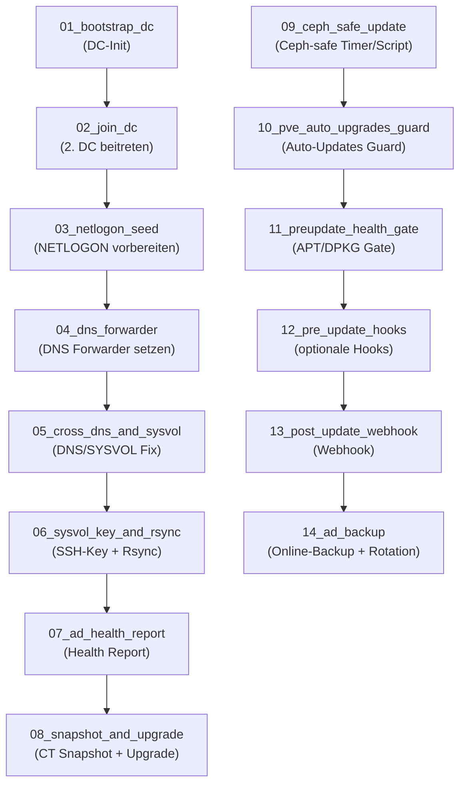
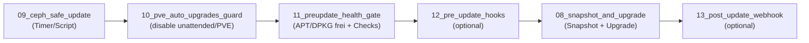
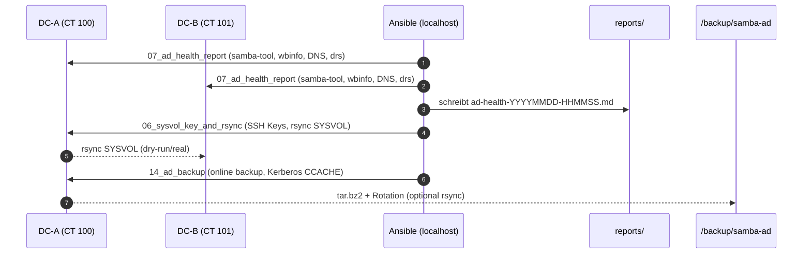

# Diagrams – Zamba / Proxmox Automation Suite

> GitHub-kompatible Mermaid-Diagramme ohne Parserfehler.  
> Enthält Flows, Ops-Pipeline und AD-/Backup-Übersicht.

---

## 1) Gesamtübersicht: Playbooks 01–14

---

## 2) Update- & Wartungspipeline

---

## 3) AD-Health & Backup

---

## 4) Hinweise

- **Kompatibel mit GitHub und Obsidian (Mermaid >=10.4)**  
- ` ` wird als Zeilenumbruch unterstützt  
- **IDs stehen immer vor Labels** (z. B. `U11["Text"]`)

---

